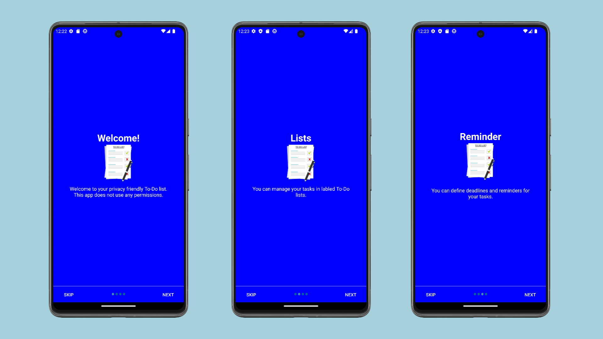
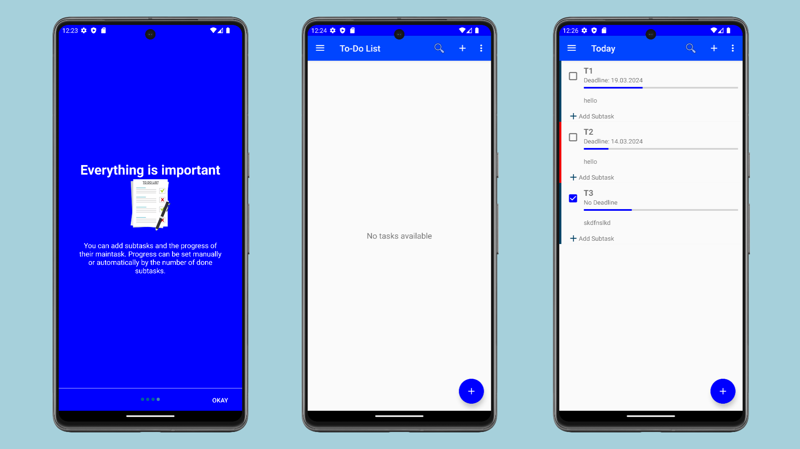
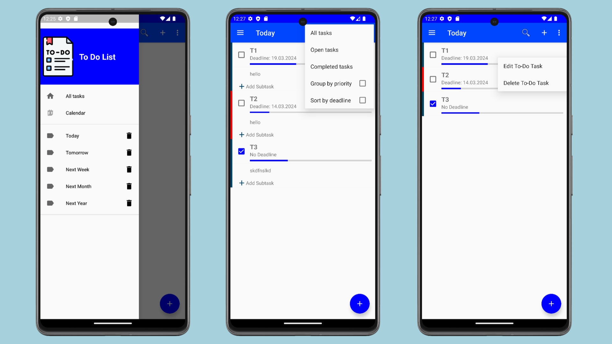
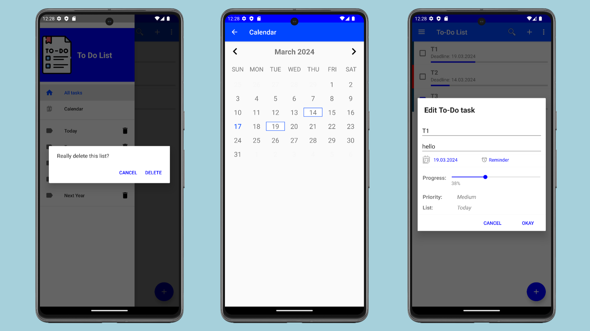

# ToDoList Android Application (Bharat Intern Task-1)📝

Welcome to the ToDoList Android app - your ultimate task management solution! Stay organized, efficient, and on top of your tasks with our user-friendly interface and powerful features.

[](https://www.linkedin.com/in/jayesh-gojiya-6528a22ab/)
[](https://github.com/gojiyajayesh/To-Do-List_App.git)
[](https://github.com/gojiyajayesh/To-Do-List_App/stargazers)

## Features Highlights 🚀

- **Create, Edit, Delete**: Seamlessly manage your tasks with options to create, edit, and delete tasks as needed.
- **Set Reminders**: Never miss a deadline again! Set reminders for your tasks to stay on track.
- **Prioritize Tasks**: Keep important tasks at the forefront by setting priorities.
- **Dark Mode Support**: Whether it's day or night, our app ensures a comfortable viewing experience with Dark Mode support.

### Enhanced Functionality

- **Subtasks**: Dive deeper into your tasks with the ability to create and manage subtasks effortlessly.

## Sneak Peek 📸

Take a look at what awaits you:


<br>

<br>

<br>

## Get Started 🚀

1. **Download and Install**: Get the app up and running on your Android device.
2. **Stay Organized**: Create, edit, and manage tasks effortlessly.
3. **Never Miss a Beat**: Set reminders to ensure tasks are completed on time.
4. **Enjoy Dark Mode**: Optimize your experience with our Dark Mode support.

## Download Now 📥

Download the latest version [here](https://github.com/gojiyajayesh/To-Do-List_App/blob/main/apk_file/To%20Do%20List.apk)!

## Contribute 🤝

We welcome contributions! Fork the repository and submit your pull requests to make ToDoList even better.

## Roadmap 🗺

Exciting plans ahead! Here's what's in store:
- **Calendar View**: Visualize your tasks with a calendar view.
- **UI Enhancements**: Elevate your experience with improved user interface.

## Installation ⚙

Ready to get started? Follow these steps:
1. **Clone**: Clone the repository to your local machine. 
  ```bash
   git clone https://github.com/gojiyajayesh/ChatVista.git
   ```
2. **Open & Run**: Fire up Android Studio, open the project, and run it on your device or emulator.

Ready to transform the way you manage tasks? Let's do this! 💪
